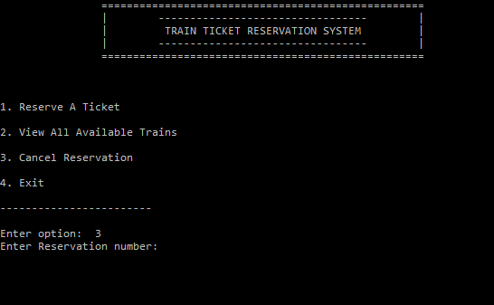

#Railway reservation system in C. 

##Functionalities supported include
1.	Reservation of seats / book a ticket.
2.	Cancellation of a booked ticket.
3.	Viewing details of the trains between pair of stations and the schedule.
4.	Checking seat availability in trains and get the fare details.

##Sample I/O

options

train details

confirmation of reservation

cancellation of reservation

